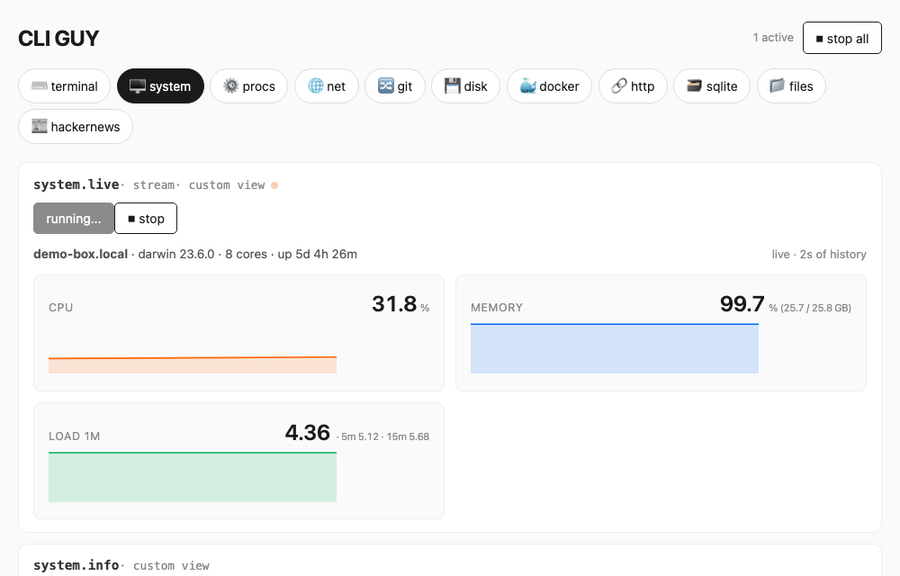

# CLI GUY

A browser-based graphical shell for any Unix box. One server, one WebSocket, one schema-driven UI, with a tab per tool. No build step, and any browser works.



Writeup: [How and why I built it](https://severino.blog/blog/cli-guy/).

It runs as a single Node process and exposes a set of "adapters" (live system stats, a real PTY terminal, processes, networking, git, disk, docker, an HTTP inspector, sqlite, a file browser, Hacker News) over one tunnel and one auth.

## Run it

```bash
npm install
PASSWORD=hello npm start
# → http://localhost:7777
```

Set `PASSWORD` to whatever you like; it gates the single login.

## How it works

- **One server, one port.** Every app is a function the server can call. No per-app servers, ports, or auth.
- **One protocol: JSON over WebSocket.** A handful of message types cover requests, results, streaming output, cancellation, and bidirectional input (which is what makes the in-browser PTY work).
- **Schema-driven UI.** Each adapter declares its operations as JSON schemas. The frontend reads `/api/manifest` and renders a form per operation. Custom views are optional Preact components.

### Add a tab

Drop a file in `adapters/`, restart, refresh:

```js
// adapters/example.js
export default {
  name: 'example', icon: '✨',
  ops: {
    hello: {
      schema: { who: { type: 'string', default: 'world', label: 'Who' } },
      run: async ({ who }) => ({ greeting: `hello, ${who}` }),
    },
  },
};
```

## Security

This is an experiment, not production code. Everything runs in one process, so a buggy or hostile adapter can reach the others, and the session has broad access to the host. There are known issues that are not fixed. Do not expose this on the public internet: run it behind an SSH tunnel, for a single trusted user.
